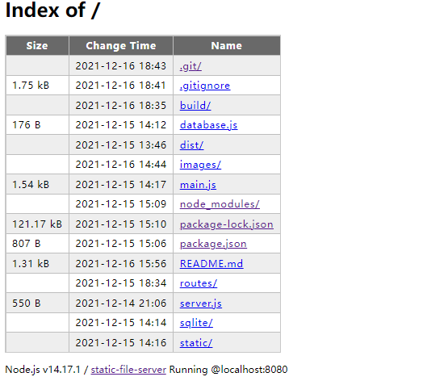

# static-file-server

st-file-server是基于node.js + pug构建的静态文件服务器

## Preview


## Usage
支持自定义打开端口，路径  
```sh
npm i -g st-file-server

st [path] [options] 
```
`[path]` 默认为 `./`  
`[options]` 可选 `-p` 后面加上端口号 (默认为8080端口)

跳转 *http://localhost:8080*

## Details
* **返回上级目录**  


* **禁止访问非根目录下的文件**  
  ```javascript
    if (!targetPath.startsWith(baseDir)) {
        res.writeHead(401)
        res.end("401 Unauthorized")
        return
    }
  ```